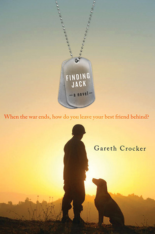
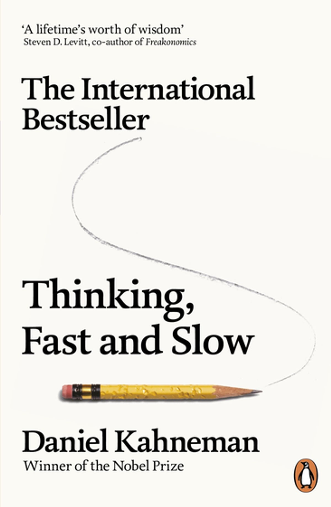

I obtained my undergraduate degree in Computer Science and Economics, as welll as Honours and Masters in Computer Science, all from the University of the Witwatersrand. Further to this I am interested in Neuroscience and Psychology, and read about these fields as much as possible.

My non-academic interests revolve around music (despite a distinct lack of rhythm), movies, sports and cat pictures.

*add cv*

## Favourite Textbooks


## Favourite Books
   
